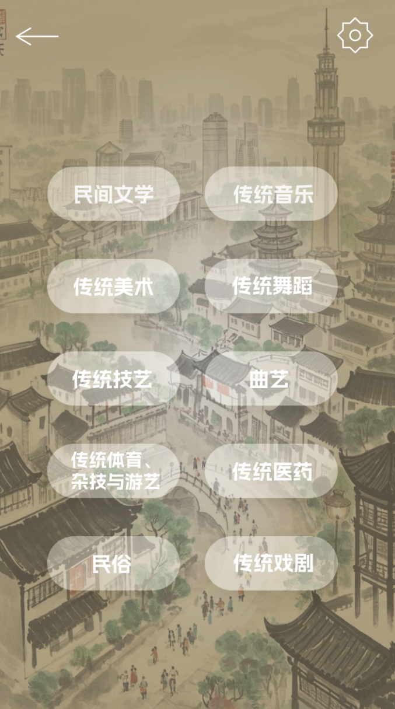

# Naikai-WJYD-project
**南开大学本科生创新科研计划—国家级大学生创新训练计划：“问津有道——基于天津市非物质文化遗产的数字人交互平台”**

# 🏮 天津非遗数字人交互系统 · Tianjin Heritage Avatar 

本项目由南开大学文学院和密码与网络空间安全学院 2023 级五名同学在南开大学文学院冉启斌教授、黄玮博士研究生指导下完成，旨在基于数字人等先进计算机科学技术，建立 AI 交互平台，构建天津市非物质文化遗产的数字化传承与传播体系，实现非遗资源的系统性保护与沉浸式交互，推动非遗文化在数字时代的创新活化，扩大非遗文化在年轻一代中的影响力，突破非遗生存困境。

> 基于天津市非物质文化遗产的重要价值与保护困境，探索在新时代以创新的方式激活非遗活力
> 一个融合优秀非遗文化与先进 AI 数字人的交互式小程序平台  
> 以天津方言、文化导览、语音互动为核心，实现非遗的沉浸式数字化传承  
> 构建非遗数据库、方言语料库、绘制文化图谱，助力国家文化战略，增强文化自信
---

## 📌 项目简介 · Introduction

本项目聚焦**天津市国家/市级非物质文化遗产**，结合生成式大语言模型（LLM）、语音识别（ASR）、方言语音合成（TTS）、图像生成（SDXL）、数字人驱动技术（Unity）等手段，打造具备“可对话、可感知、可换脸”的数字人导览交互平台，助力非遗文化在数字时代的**新青年传播与地域活化表达**。

---
## 📚 项目背景信息 · Background & Information

- **项目时间**：2024 年 11月——2026 年 4月 一年半周期
- **立项单位**：南开大学文学院
- **项目性质**：国家级大学生创新训练计划、应用性研究、自主选题
- **所属学科**：中国语言文学、计算机科学与技术
  - 掌握 Transformer 与大语言模型原理
  - 探索 LoRA、BitsAndBytes 等微调技术
  - 实现模型训练 → 推理 → 评估 → 应用全流程

---
## 👥 团队成员 · Members

| 姓名   | 学院及专业               | 学号     |
|--------|------------------------|----------|
| 郭雅茹 | 文学院-汉语言文学    | 2310646  |
| 赵欣怡 | 文学院-汉语言文学    | 2311578  |
| 肖俊涛 | 密码与网络空间安全学院-信息安全与法学    | 2313226  |
| 杨紫辰 | 计算机学院-计算机科学与技术    | 2313227  |
| 王斯毅 | 计算机学院-计算机科学与技术    | 2312999  |

> 🧑‍🏫 **指导教师**：冉启斌（文学院教授，副院长） 黄玮（南开大学文学院2023级博士研究生）

---
## 🔍 功能模块 · Function

| 模块              | 描述                               |
| --------------- | -------------------------------- |
| 📦 **非遗多模态数据库** | 整理 50 项非遗资料（文本/图片/视频/音频）并向量化检索    |
| 🧠 **AI 语义问答**  | 基于现有开源大模型 Qwen2-0.5B LoRA 微调，具备非遗知识专业问答能力 |
| 🔊 **津普双模 TTS** | 识别并理解天津话 / 普通话，实现双语应答播报，沉浸式听觉体验            |
| 🎭 **数字人形象设计**  | SDXL 插画 + Unity 表情驱动，支持用户AI换脸互动      |
| 📱 **小程序交互平台**  | 微信小程序实现语音文字双输入，图文音融合输出，依托云服务器           |

---
## 📷 系统演示 · FPictures



## ⚙️ 技术栈 · Technology Stack

| 类别    | 技术                          | 用途               |
| ----- | --------------------------- | ---------------- |
| 语言模型  | PyTorch + HuggingFace       | 微调非遗知识问答模型       |
| 模型压缩  | LoRA + GGUF                 | 降低部署成本，支持 CPU 推理 |
| 检索系统  | FAISS                       | 支持语义级向量检索        |
| 语音合成  | edge-tts / 自训 TTS           | 普通话 / 天津话语音播报    |
| 图像生成  | Stable Diffusion XL         | 插画生成，数字人图形外观     |
| 数字人驱动 | Unity + Audio2Face          | 口型、动作、换脸         |
| 后端框架  | FastAPI + Uvicorn           | API 服务接口层        |
| 数据库   | PostgreSQL / SQLite / MinIO | 存储多模态非遗数据        |
| 前端    | UniApp + Vue3 + ECharts     | 微信小程序前端 UI       |

---
## 📅 项目进度安排

| 周数 | 任务内容                                  |
|--------|----------------------------------------------|
| 第 1 周 | 项目启动、理论学习、环境配置、模型理解       |
| 第 2 周 | 数据准备、LoRA 微调、训练脚本实现            |
| 第 3 周 | 模型训练实验、评估指标实现                   |
| 第 4 周 | 推理接口开发、总结报告撰写与展示             |

---
## 📄 License
本项目采用 MIT License 开源协议，欢迎使用、引用、改进
---
## 📁 项目结构
```text
Nankai-WJYD-project/
tianjin-heritage-avatar/
├── backend/             # FastAPI 后端服务
│   ├── app/             # 主程序
│   └── requirements.txt
├── frontend/            # 小程序前端
├── models/              # LLM / TTS 模型存储路径
├── data/                # 非遗素材（文本/图像/音频等）
├── docs/                # 项目文档、结构图
├── assets/              # README用截图/图标
└── README.md
